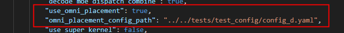
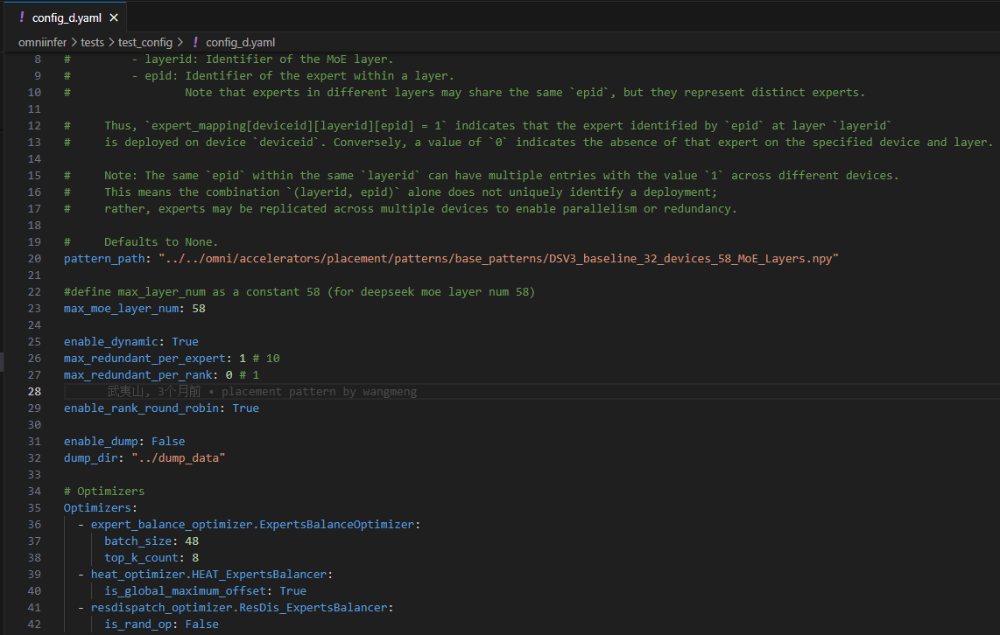
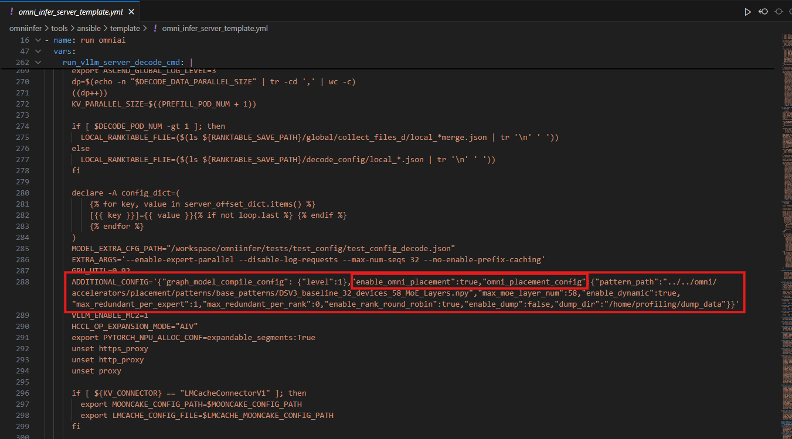
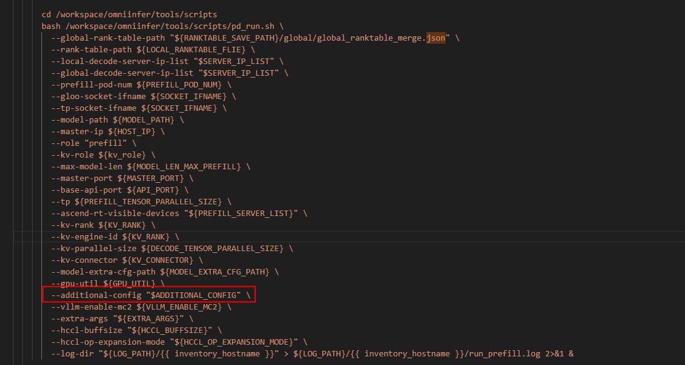
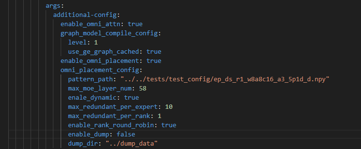

# 新版本omniplacement配置迁移修改方式

**1.原拉起方式：**
**ansible/CLI拉起：**
在P,D节点对应的 `MODEL_EXTRA_CFG_PATH`的 json文件中 有
如下两个参数：

 

其中 `use_omni_placement` 是对应omni_placement功能开关

`omni_placement_config_path`是omniplacement在该实例配置参数的路径，打开对应路径的yaml文件后，有如下参数：
 


其中需要迁移的参数是：
`pattern_path`
`max_moe_layer_num`

`enable_dynamic`
`max_redundant_per_expert`
`max_redundant_per_rank`

`enable_rank_round_robin`

`enable_dump`
`dump_dir`

也可以按需要添加其他需要迁移和添加的参数。

**2.新版本拉起方式：**
如果之前omni_placement是关闭的（ `use_omni_placement` 为`False`），则不需要修改;

如果需要开启omni_placement，则做如下迁移：

**ansible脚本拉起：**
在ansible server.yml文件中

`run_vllm_server_prefill_cmd`
和
`run_vllm_server_decode_cmd`

添加如下参数：
如果没有`ADDITIONAL_CONFIG`，则先添加`ADDITIONAL_CONFIG`；如果有，则在已有属性上逗号添加后续omniplacement参数：

 

在
` ADDITIONAL_CONFIG='{"enable_omni_placement":true,"omni_placement_config":{"pattern_path":"../../omni/accelerators/placement/patterns/placement_pattern_20250626_221356_58_rearrange_layers_58_layers_16_ranks_prefill_step0to100000.npy","max_moe_layer_num":58,"enable_dynamic":false,"max_redundant_per_expert":1,"max_redundant_per_rank":0,"enable_rank_round_robin":false,"enable_dump":false,"dump_dir":"/home/profiling/dump_data"}}'`
中
`"enable_omni_placement":true` 是控制 omniplacement开关，要和之前的 `use_omni_placement` 保持一致

在omni_placement开启情况下：`"omni_placement_config"`控制omniplacement参数，将上面yaml文件中参数：
`pattern_path`
`max_moe_layer_num`

`enable_dynamic`
`max_redundant_per_expert`
`max_redundant_per_rank`

`enable_rank_round_robin`

`enable_dump`
`dump_dir`
的键值对分别填入omni_placement_config的值中即可
`"omni_placement_config":{"pattern_path":"../../omni/accelerators/placement/patterns/placement_pattern_20250626_221356_58_rearrange_layers_58_layers_16_ranks_prefill_step0to100000.npy","max_moe_layer_num":58,"enable_dynamic":false,"max_redundant_per_expert":1,"max_redundant_per_rank":0,"enable_rank_round_robin":false,"enable_dump":false,"dump_dir":"/home/profiling/dump_data"}`

注：
1.建议dump_dir采用绝对路径
2.如果不同模型加入新的omniplacement参数，可以用A:B的方式加入omni_placement_config的值内部即可

还需要检查`run_vllm_server_prefill_cmd`
和
`run_vllm_server_decode_cmd`的`bash pd_run.sh`部分
如果没有additional_config参数，需要加入
`--additional-config "$ADDITIONAL_CONFIG" \`

 

**CLI拉起：**
在CLI拉起脚本中加入：

 
```
            additional-config:
              enable_omni_attn: true
              graph_model_compile_config:
                level: 1
                use_ge_graph_cached: true
              enable_omni_placement: true
              omni_placement_config:
                pattern_path: "../../tests/test_config/ep_ds_r1_w8a8c16_a3_5p1d_d.npy"
                max_moe_layer_num: 58
                enale_dynamic: true
                max_redundant_per_expert: 10
                max_redundant_per_rank: 1
                enable_rank_round_robin: true
                enable_dump: false
                dump_dir: "../dump_data"
```

这里

```
              enable_omni_placement: true
              omni_placement_config:
                pattern_path: "../../tests/test_config/ep_ds_r1_w8a8c16_a3_5p1d_d.npy"
                max_moe_layer_num: 58
                enale_dynamic: true
                max_redundant_per_expert: 10
                max_redundant_per_rank: 1
                enable_rank_round_robin: true
                enable_dump: false
                dump_dir: "../dump_data"
```

这些值与之前omniplacement的参数需要保持一致

注：1.每个P节点的additional-config内的`enable_omni_placement`和`omni_placement_config`需要完全一致
2.每个D节点的additional-config内的`enable_omni_placement`和`omni_placement_config`需要完全一致