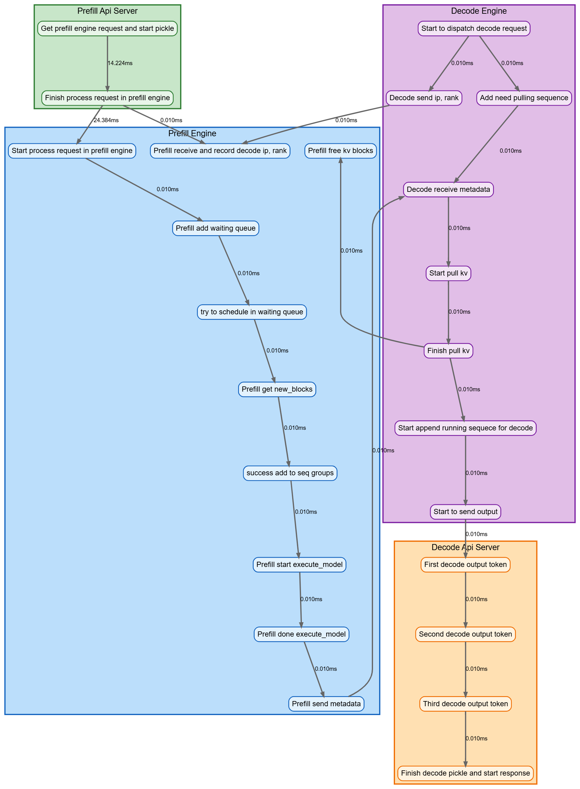

## Function-Level Profiling Patches

This folder provides a **non-intrusive way to apply function-level profiling**.

### Supported Profilers

1. **Marker** - Simply add something before/after target functions.
2. **Timer** – Basic time measurement for target functions.
3. **VizTracer** – Execution trace visualization using VizTracer.
4. **Torch-NPU** – Profiling via `torch_npu.profiler`.

### Enable Profiling

Set the corresponding environment variable to a YAML config file:

* `PROFILING_NAMELIST`

### Usage
* export PROFILING_NAMELIST=/path/to/namelist.yml
* Example yaml configs are in the [`assets/`](./assets) folder.
* export ROLE=prefill or export ROLE=decode

### Step to use omnilogger_namelist.yml for vllm tracing

Export the path to the namelist configuration:

```bash
export PROFILING_NAMELIST={project_root}/omni_infer/omni/tools/profiler/assets/omnilogger_namelist.yml
```

By default, logs are saved to `/tmp/trace_output_directory`.
To change this location, set the `TRACE_OUTPUT_DIRECTORY` environment variable:

```bash
export TRACE_OUTPUT_DIRECTORY=/your/custom/path
```

### Collect logs and parse logs to valuable data
#### Integrated method
You can collect logs form multiple nodes and parse them with the file `parse_logs.sh`. 
The variables you need to modify are:

```plaintext
1. SERVER_LIST: all nodes' IP
2. REMOTE_FOLDER: trace logs' storage location on target machines, default is /tmp/trace_output_directory/
3. PROXY_FOLDER: the directory of nginx_error.log
4. TARGET_FOLDER:  trace logs' storage location on execution machine
5. PRIVATE_KEY: the path of private key
6. CONNECTOR_TYPE: First P Then D - p2d / First D Then P - d2p
```

After modifying the above variables, you can execute the command:
```bash
bash parse_logs.sh
```

Then you will get an excel `time_analysis.xlsx`, which includes three sheets: `time_analysis`, `Summary`, `time_difference`, and a directory `graphviz_output`, which
includes the code file of flowchart. 

You can analyse datas through the excel or directly view the flowchart with average time consuming generated by .dot code. There are two methods to view flowchart.

Method 1: install the plugin "Graphviz Interactive Preview" in VSCode, and view through the plugin.

Method 2: copy the generated codes into https://dreampuf.github.io/GraphvizOnline directly.

You can get a flowchart like similar to the one below(the time of each phase 
in the diagram are not actual test values and are for reference only).



#### Step-by-step method
You can collect logs from multiple nodes by specifying them in a `server_list.txt` file, then running the provided script.

`server_list.txt`

```
10.11.123.1
10.11.123.2
10.11.123.3
10.11.123.4
```

 `collect_logs.sh`

```bash
#!/bin/bash
# Usage: ./collect_logs.sh server_list.txt /tmp/trace_output_directory  nginx_log_path your_log_directory p2d/d2p

SERVER_LIST="$1"
REMOTE_FOLDER="$2"
PROXY_FOLDER="$3"
TARGET_FOLDER="$4"

mkdir $TARGET_FOLDER

for IP in $(cat "$SERVER_LIST"); do
    echo "Collecting logs from $IP..."
    scp -i key.pem -r "root@$IP:$REMOTE_FOLDER" "./logs_$IP"
    mv "./logs_$IP" $TARGET_FOLDER

    # copy logs in proxy
    if ssh -i key.pem root@$IP "test -f '$PROXY_FOLDER/nginx_error.log'"; then
        echo "nginx_error.log found on $IP, copying..."
        scp -i key.pem "root@$IP:$PROXY_FOLDER/nginx_error.log" "$TARGET_FOLDER/nginx_${IP}.log"
    fi
done
```

Once logs are collected, parse them using:

```bash
python parse_logs.py your_log_directory
```

### Convert logs to JSON
In addition to the above steps, you can also convert logs to JSON that can be accepted by Jaeger. 
```bashs
python log_to_jaeger.py your_log_directory trace.json
```
See more details in file `../trace/README.md`.